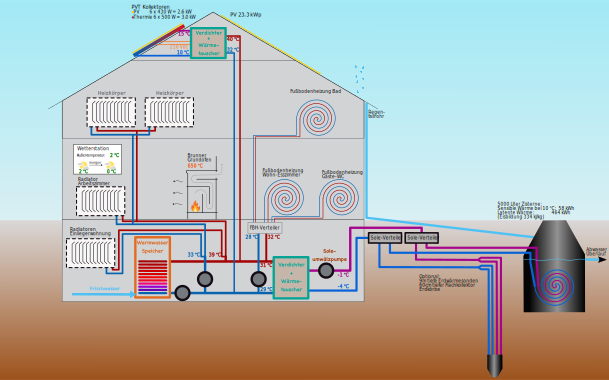

# Web Apps
[https://Philip-Kiehnle.github.io/HVACsystem](https://Philip-Kiehnle.github.io/HVACsystem)

## Heating System Analyser
The Heating System Analyser is a web application that can be used to upload an SVG file containing a plan of a heating system for analysing radiators and pipes.  
The page  [https://Philip-Kiehnle.github.io/HVACsystem/HeatingSystemAnalyser/index.html](https://Philip-Kiehnle.github.io/HVACsystem/HeatingSystemAnalyser/index.html) also includes a demo.svg file.  
Individual radiator controls allow the flows and pressures in the system to be analysed.
